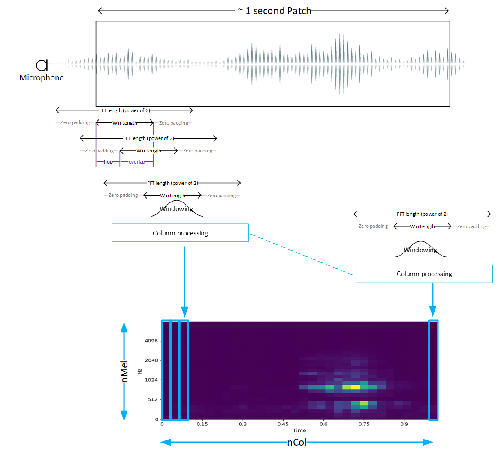
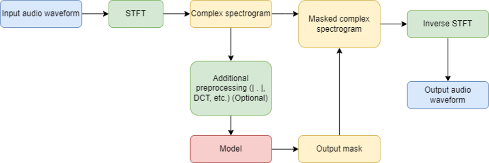
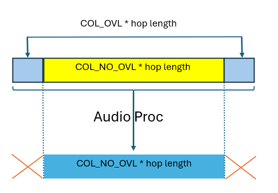

# Audio Getting Start Package

This project provides an STM32 Microcontroler embedded real time environement
to execute [X-CUBE-AI](https://www.st.com/en/embedded-software/x-cube-ai.html)
generated model targetting audio applications. The purpose of this package is to
stream physical data acquired by sensors into a processing chain including a
preprocessing step that typically would perform a first level of feature
extraction, the machine learning inference itself, and a post processing step
before exposing the results to the user in real time. The project implements
both RTOS and bare metal versions. A low power version is also provided.

## Keywords

Getting Start, Model Zoo, Sensing, Audio, X-CUBE-AI, STM32N6

## Table of Contents

- [Directory contents](#directory-contents)
- [Hardware and Software environment](#hardware-and-software-environment)
  - [Hardware support](#hardware-support)
  - [Boot modes](#boot-modes)
  - [Serial port configuration](#serial-port-configuration)
  - [Toolchains support](#toolchains-support)
- [Quickstart using prebuilt binaries](#quickstart-using-prebuilt-binaries)
- [Deployement](#deployement)
  - [Model zoo deployment](#model-zoo-deployment)
  - [Manual deployment](#manual-deployment)
- [Configuration](#configuration)
  - [Application](#application)
  - [AED example](#aed-example)
  - [SE example](#se-example)
- [History](#history)

## Directory contents

This repository is structured as follows:

| Directory                                             | Content                                    |
|:----------------------------------------------------- |:------------------------------------------ |
| Projects/GS                                           | Getting Started main application           |
| Projects/GS/STM32CubeIDE                              | IDE project files                          |
| Projects/GS/ThreadX                                   | RTOS application files                     |
| Projects/DPU                                          | Digital Processing Units                   |
| Projects/X-CUBE-AI                                    | X-CUBE-AI application                      |
| Projects/X-CUBE-AI/models                             | examplary AI models                        |
| Projects/Common                                       | commonly used N6 application files         |
| Middlewares/ST/AI                                     | AI runtime library & Npu low level drivers |
| Middlewares/ST/STM32_AI_AudioPreprocessing_Library    | Audio Preprocessing library                |
| Middlewares/ST/ThreadX                                | Azure RTOS ThreadX                         |
| Drivers                                               | Hardware drivers & base port               |
| Binaries                                              | Prebuilt binaries                          |

## Hardware and Software environment

### Hardware support

- MB1939 STM32N6570-DK board
  - The following OTP fuses must be set
    - VDDIO2_HSLV=1     I/O XSPIM_P1 High speed option enabled
    - VDDIO3_HSLV=1     I/O XSPIM_P2 High speed option enabled
  - *Warning*: when OTP fuses are set, they can not be reset.
  - *Warning*: when executing the project on the board, these two OTP fuses are
   set if not already

### Boot modes

The STM32N6 does not have any internal flash. To retain your firmware after a
reboot, you must program it in the external flash. Alternatively, you can load
your firmware directly from SRAM (dev mode). However, in dev mode if you turn
off the board, your program will be lost.

- Dev mode: load firmware from debug session in RAM (boot switch to the right)
- Boot from flash: Program firmware in external flash (boot switch to the left)

### Serial port configuration

This package outputs results and useful information (depending on the configured
level of verbosity) through a serial connection. the default configuration of
this serial link is such:

- Speed = 14400 bauds
- Data = 8 bit
- Parity = None
- Stop bit = 1 bit
- Flow control = none

### Toolchains support

- STM32CubeIDE v1.17
- STM32Cube.AI v10.0.0

## Quickstart using prebuilt binaries

Two use cases are provided as examples:

  1. Audio Event Detection (aed)
  2. Speech Enhancement (se)

for each use case, a pre-trained model is used, and its weigths are provided in
binary format:

- `Binaries/aed_weights.bin`
- `Binaries/se_weights.bin`

for each use case 4 application builds combining bare metal (bm) or ThreadX (tx)
and low power (lp) are provided:

- `Binaries/aed_bm.bin`
- `Binaries/aed_bm_lp.bin`
- `Binaries/aed_tx.bin`
- `Binaries/aed_tx_lp.bin`
- `Binaries/se_bm.bin`
- `Binaries/se_bm_lp.bin`
- `Binaries/se_tx.bin`
- `Binaries/se_tx_lp.bin`

Three binaries must be programmed in the board external flash using the
following procedure:

  1. Switch BOOT1 switch to right position
  2. Program `Binaries/fsbl_fw_lrun_v1.2.0.bin` (First stage boot loader @0x70000000 )
  3. Program `Binaries/[aed,bm]_weights.bin` (params of the networks @0x70180000; To be changed only when the network is changed)
  4. Program `Binaries/[aed,bm]_[bm,tx]_[lp].bin` (signed firmware application @0x70100000)
  5. Switch BOOT1 switch to Left position
  6. Power cycle the board

After setting you own `pathCubeIde` variable in `Binaries/flash-bin.sh`

```bash
pathCubeIde="<your path to cube IDE>"
pathProg="<your relative path to cube IDE programmer plug in>"
```

Source `flash-bin.sh` with two arguments:

  1. the use case (se/aed)
  2. the build configuration (bm/bm_lp/rx/tx_lp)

Afer setting BOOT1 switch to the left position, and power cycle, here is the
typical output seen on the uart console (baud rate = 14400):

```text
System configuration (Bare Metal)
--------------------------------------------------
Log Level: Info

Compiled with GCC 12.3.1
STM32 device configuration...
 Device       : DevID:0x0486 (STM32N6) RevID:0x0000
 Core Arch.   : M55 - FPU  used
 HAL version  : 0x01000000
 SYSCLK clock : 600 MHz
 HCLK clock   : 400 MHz
 CACHE conf.  : $I/$D=(True,True)

NPU Runtime configuration...
 NPU clock    : 800 MHz
 NIC clock    : 800 MHz

ATONN Model
--------------------------------------------------
 name          : network
 n_epochs      : 39
 params        : 0 KiB
 activations   : 144 KiB
 n_inputs      : 1
 name    : Input_0_out_0
  addr   : 0x34350000 (6144 bytes)  (8 bits)
  type   : 3 shape(4)=(1,64,96,1)
  quant  : scale=0.030531, zp=33
 n_outputs     : 1
 name    : Softmax_102_out_0
  addr   : 0x34350410 (40 bytes)  (32 bits)
  type   : 1 shape(4)=(1,1,1,10)

------------- Start Processing -------------------

{"class":"clock_tick"}
{"class":"clock_tick"}
{"class":"clock_tick"}
{"class":"unknown"}
```

Two extra features are implemented:

1. *Random load generation* demonstrates system availiblity for additional
flexible parallel processing. This feature is not avalaible in bare metal
implementation.
2. *Bypass audio processing* allows the user to appreciate the benefit of audio
processing by comparing when teh audio is directly looped back on the headset
without any AI processing. This feature is relevant to speeech enhancemnent (SE)
only.

Depending on configuration user button allocations are as follow:

| Configuration             | USER1 Button      | TAMP Button            |
|:------------------------- |:------------------|:---------------------- |
| AED BM or BM-LP           | N/A               | N/A                    |
| AED TX or TX-LP           | N/A               | Random load generation |
| SE  TX or TX-LP           | Bypass audio proc | Random load generation |
| SE  BM or BM-LP           | Bypass audio proc | N/A                    |

Note that:

  1. Random load generation results in fast red LED blinking
  2. Bypass results audio in red LED toggling
  3. Green LED toggles at each audio patch acquisition

## Deployement

This Getting Started includes all the application code and libraries but the
specific AI parts:

- The AI runtime Librarie
- The header files that exposes the API's of the above mentionned librarie
- The low level drivers for ATON, the STM32N6 Neural-ART™ accelerator
- The model C code (`network.c`)
- The AI processing chain description, including post and pre processing
(`ai_model_config.h`)
- The look up tables for preprocessing that depends on porcessing parameters
chosen by the user and implemented as look-up table for optimisation purposes.

The python scripts provided in model zoo will generate those missing bits before
firmware can be built.

### Model zoo deployment

After training and compiling the model designed for an STM32N6, the deployment
phase will make use of the following paremeters included in user configuration
*yaml* file:

```yaml
general:
  project_name: aed_project
  model_path: <model_zoo_storage>/audio_event_detection/yamnet/ST_pretrainedmodel_public_dataset/esc10/yamnet_1024_64x96_tl/yamnet_1024_64x96_tl_qdq_int8.onnx
```

gives the model path that will be deployed

```yaml
dataset:
  name: esc10
  class_names: ['dog', 'chainsaw', 'crackling_fire', 'helicopter', 'rain', 'crying_baby', 'clock_tick', 'sneezing', 'rooster', 'sea_waves']
```

gives the classification of the model

```yaml
feature_extraction:
  patch_length: 96
  n_mels: 64
...
```

gives the parameters for preprocessing

```yaml
tools:
  stedgeai:
    version: 10.0.0
    optimization: balanced
    on_cloud: False
    path_to_stedgeai: C:/Users/<XXXXX>/STM32Cube/Repository/Packs/STMicroelectronics/X-CUBE-AI/<*.*.*>/Utilities/windows/stedgeai.exe
  path_to_cubeIDE: C:/ST/STM32CubeIDE_1.17.0/STM32CubeIDE/stm32cubeide.exe
```

gives the details of your local tool environement.

```yaml
deployment:
  c_project_path:  ../../application_code/audio/STM32N6
  IDE: GCC
  verbosity: 1
  hardware_setup:
    serie: STM32N6
    board: STM32N6570-DK
  build_conf : "N6 Audio Bare Metal" # this is default configuration
  # build_conf : "N6 Audio Thread X"
  # build_conf : "N6 Audio Bare Metal Low Power"
  # build_conf : "N6 Audio Thread X Low Power"
  unknown_class_threshold: 0.5 # Threshold used for OOD detection. Mutually exclusive with use_garbage_class
                               # Set to 0 to disable. To enable, set to any float between 0 and 1.
```

At last, you specify the board deployment details, including the build
configuration, which allows to build a combination of Bare Metal/ RTOS and
Low Power. Note that if build_conf is omitted then the configuration "*Bare
Metal with no Low Power*" is used by default

### Manual deployment

Note that the steps below are implemented in `deploy-model.sh` found under
`Projects\X-CUBE-AI\models`. you need to provide three arguments:

  1. model file (xxx.onnx)
  2. type of model (se/aed )
  3. build configuration (BM/BM_LP/TX/TX_LP)

This script implements the following steps:

  1. Generates of c-model from model for N6
  2. Generates and installs headers
  3. Builds FW with Cube IDE
  4. Signs and flashes FW

in the following scripts files:

  1. generate-n6-model.sh
  2. generate-n6-model-headers.sh
  3. build-firmware.sh
  4. sign-and-flash-model.sh

Here are two examples of usage :

  1. source deploy-model.sh stft_tcnn_int8_static_40.onnx se BM
  2. source deploy-model.sh yamnet_1024_64x96_tl_qdq_int8.onnx aed BM_LP

You need to specify you own enviroment in these shell scripts

in `generate-n6-model.sh`

```bash
generateCmd="<PathtoStedgeAI>/Utilities/windows/stedgeai.exe"   
```

in `build_firmware.sh`

```bash
pathCubeIde="<PathtoCube IDE>/STM32CubeIDE"
project="file://<Path_to_Project>/GS_Audio_N6/Projects/GS/STM32CubeIDE"
```

in `sign-and-flash-model.sh`

```bash
pathCubeIde="<PathtoCube IDE>"
pathProg="/plugins/<cube programmer plug-in>/tools/bin"
```

for `generate-n6-model-headers.sh` you need to install required python modules

```bash
pip install -r GenHeader/requirements.txt
```

## Configuration

The user has the possibility to override the default application configuration
by altering  `<getting-start-install-dir>/Projects/GS/Inc/app_config.h`, and the
AI model by altering `<getting-start-install-dir>/Projects/DPU/ai_model_config.h`.

### Application

in  `<getting-start-install-dir>/Projects/GS/Inc/app_config.h`,you can change
the default verbosity of the application by setting the `LOG_LEVEL`:

```C
#define LOG_LEVEL LOG_INFO
```

You migth also want to adapt the serial link baud rate:

```C
#define USE_UART_BAUDRATE 14400
```

### AED example

The example provided below is based on Yamnet 1024 model provided in the
ST model zoo.

in `<getting-start-install-dir>/Projects/DPU/ai_model_config.h`, first describe
the number and the nature of the model output and its type:

```C
#define CTRL_X_CUBE_AI_MODE_NB_OUTPUT          (1U) /* or (2U)*/
#define CTRL_X_CUBE_AI_MODE_OUTPUT_1           (CTRL_AI_CLASS_DISTRIBUTION)
```

Then you describe the class indexes and their labels in this way:

```C
#define CTRL_X_CUBE_AI_MODE_CLASS_NUMBER       (10U)
#define CTRL_X_CUBE_AI_MODE_CLASS_LIST         {"chainsaw","clock_tick",\
                "crackling_fire","crying_baby","dog","helicopter","rain",\
                                         "rooster","sea_waves","sneezing"}
```

Now you can select audio preprocessing type:

```C
#define CTRL_X_CUBE_AI_PREPROC                 (CTRL_AI_SPECTROGRAM_LOG_MEL)
```

For spectrogram log mel pre processing you need to specify the various
parameters of the patch processing:



The parameters are:

```C
#define CTRL_X_CUBE_AI_SPECTROGRAM_NMEL          (64U)
#define CTRL_X_CUBE_AI_SPECTROGRAM_COL           (96U)
#define CTRL_X_CUBE_AI_SPECTROGRAM_HOP_LENGTH    (160U)
#define CTRL_X_CUBE_AI_SPECTROGRAM_NFFT          (512U)
#define CTRL_X_CUBE_AI_SPECTROGRAM_WINDOW_LENGTH (400U)
#define CTRL_X_CUBE_AI_SPECTROGRAM_NORMALIZE     (0U) // (1U)
#define CTRL_X_CUBE_AI_SPECTROGRAM_FORMULA       (MEL_HTK) //MEL_SLANEY
#define CTRL_X_CUBE_AI_SPECTROGRAM_FMIN          (125U)
#define CTRL_X_CUBE_AI_SPECTROGRAM_FMAX          (7500U)
#define CTRL_X_CUBE_AI_SPECTROGRAM_TYPE          (SPECTRUM_TYPE_MAGNITUDE)
#define CTRL_X_CUBE_AI_SPECTROGRAM_LOG_FORMULA   (LOGMELSPECTROGRAM_SCALE_LOG)
```

For optimizing Mel Spectrogram computational performances the following *L*ook
*U*p *T*ables (*LUT*) needs to be provided:

- the smoothing window to be applied before the Fast Fourrier transform , this
is typically an Hanning window the table is named with the following defines:

```C
#define CTRL_X_CUBE_AI_SPECTROGRAM_WIN           (user_win)
```

- the Mel filters taps. Only non nul taps are provided in a concatenated form,
which is why start and stop indexes are provided in separated tables

```C
#define CTRL_X_CUBE_AI_SPECTROGRAM_MEL_LUT       (user_melFiltersLut)
#define CTRL_X_CUBE_AI_SPECTROGRAM_MEL_START_IDX (user_melFilterStartIndices)
#define CTRL_X_CUBE_AI_SPECTROGRAM_MEL_STOP_IDX  (user_melFilterStopIndices)
```

Typically, *LUT*s will directlty be generated by the ST model zoo deployement
script. Alternatively python scripts are provided in
`<getting-start-install-dir>/Projects/X-CUBE-AI/models/GenHeader`.

These *LUT*s are defined in
`<getting-start-install-dir>/Projects/DPU/user_mel_tables.c` and declared in
`<getting-start-install-dir>/Projects/DPU/user_mel_tables.h`

You will now describe the digital microphone that will connect to the AI
processing chain:

```C
#define CTRL_X_CUBE_AI_SENSOR_TYPE            (COM_TYPE_MIC)
#define CTRL_X_CUBE_AI_SENSOR_ODR             (16000.0F)
#define CTRL_X_CUBE_AI_SENSOR_FS              (112.5F)
```

### SE example

The example provided below is based on the temporal convolutional network model
provided in the ST model zoo implementing a speech enhancer. A block diagram is
proposed below:



in `<getting-start-install-dir>/Projects/DPU/ai_model_config.h`, first describe
the number and the nature of the model output and its type:

```C
#define CTRL_X_CUBE_AI_MODE_NB_OUTPUT            (1U)
#define CTRL_X_CUBE_AI_MODE_OUTPUT_1             (CTRL_AI_SPECTROGRAM)
```

Then specify pre-processing as Short Term Fourier Transform and post processing
as Inverse Short Term Fourier Transform :

```C
#define CTRL_X_CUBE_AI_PREPROC                   (CTRL_AI_STFT)
#define CTRL_X_CUBE_AI_POSTPROC                  (CTRL_AI_ISTFT)
```

For Short Term Fourier Transform you need to specify the following
parameters:

```C
#define CTRL_X_CUBE_AI_SPECTROGRAM_HOP_LENGTH    (160U)
#define CTRL_X_CUBE_AI_SPECTROGRAM_NFFT          (512U)
#define CTRL_X_CUBE_AI_SPECTROGRAM_WINDOW_LENGTH (400U)
```

For optimizing Mel Spectrogram computational performances the following *L*ook
*U*p *T*ables (*LUT*) needs to be provided:

- the smoothing window to be applied before the Fast Fourrier transform , this
is typically an Hanning window the table is named with the following defines:

```C
#define CTRL_X_CUBE_AI_SPECTROGRAM_WIN           (user_win)
```

For real time processing you need to specify how mamy columns needs to be
computed, and how many columns needs to overlap to between two patchs to
mitigate inter patch.

```C
#define CTRL_X_CUBE_AI_SPECTROGRAM_COL_NO_OVL    (30U) 
#define CTRL_X_CUBE_AI_SPECTROGRAM_COL_OVL       (5U) 
```



Optionally you can specify a threshold (in dB) under which the samples will be
silented:

```C
#define CTRL_X_CUBE_AI_AUDIO_OUT_DB_THRESHOLD    (-50.0F) 
```

You will now describe the digital microphone that will connect to the AI
processing chain:

```C
#define CTRL_X_CUBE_AI_SENSOR_TYPE            (COM_TYPE_MIC)
#define CTRL_X_CUBE_AI_SENSOR_ODR             (16000.0F)
#define CTRL_X_CUBE_AI_SENSOR_FS              (112.5F)
```

## History

### V1.0 Initial Version

- First release of getting started exposing:
  - Audio Event Detection
  - Speech enhancement
