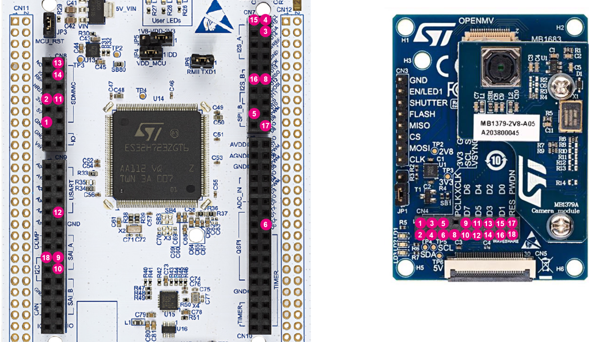
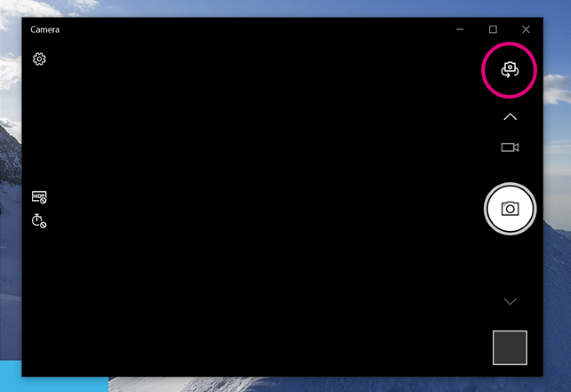
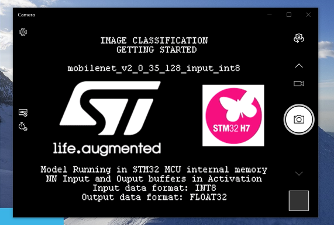
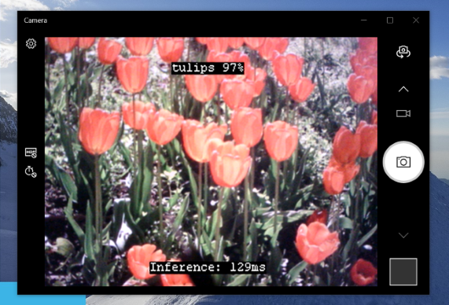
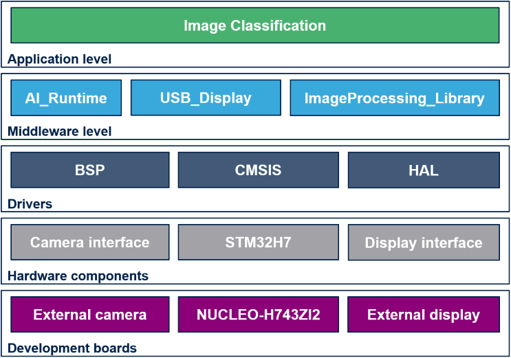
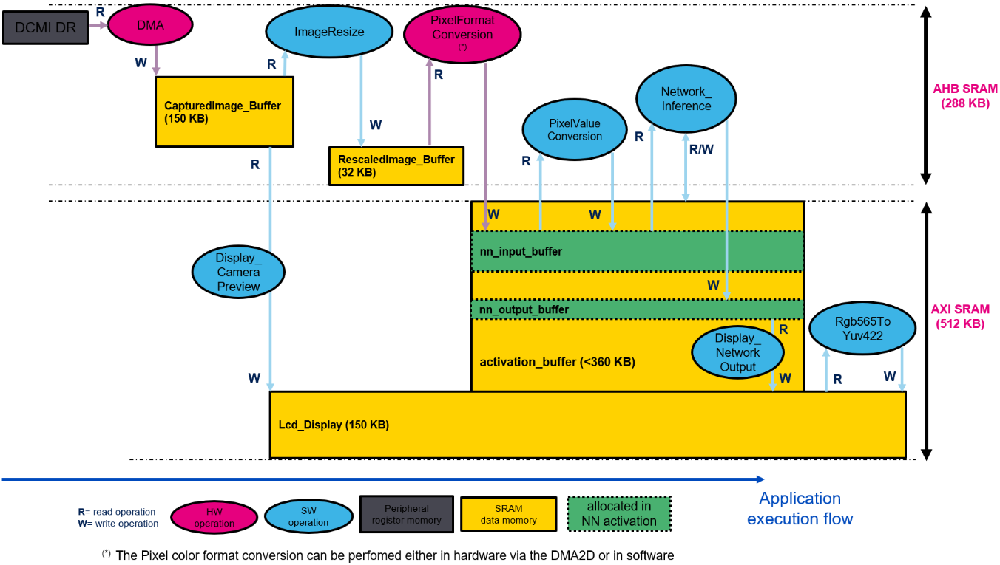

# __Image classification getting started - NUCLEO-H743ZI2__

The purpose of this package is to enable image classification application on a STM32 board.

This project provides an STM32 microcontroller embedded real time environment to execute [X-CUBE-AI](https://www.st.com/en/embedded-software/x-cube-ai.html) generated models targeting image classification applications.


### __Directory contents__

This repository is structured as follows:

| Directory                                                                | Content                                                         |
|:----------------------------------------------------------------------   |:---------------------------------------------------------       |
| Application\\<STM32_Board_Name>\STM32CubeIDE                             | cubeIDE project files; only IDE files related                   |
| Application\\<STM32_Board_Name>\Inc                                      | Application include files                                       |
| Application\\<STM32_Board_Name>\Src                                      | Application source files                                        |
| Application\Network\\*                                                   | *Place holder* for AI C-model; files generated by STM32Cube.AI  |
| Drivers\CMSIS                                                            | CMSIS Drivers                                                   |
| Drivers\BSP                                                              | Board Support Package and Drivers                               |
| Drivers\STM32XXxx_HAL_Driver                                             | Hardware Abstraction Layer for STM32XXxx family products        |
| Middlewares\ST\STM32_AI_Runtime                                          | *Place holder* for AI runtime library                           |
| Middlewares\ST\STM32_ImageProcessing_Library                             | Usual image processing functions                                |
| Middlewares\ST\STM32_USB_Camera                                          | USB camera library                                              |
| Middlewares\ST\STM32_USB_Device                                          | USB device library                                              |
| Middlewares\ST\STM32_USB_Display                                         | USB display library                                             |
| Middlewares\ST\STM32_USB_Host                                            | USB host library                                                |
| Middlewares\Utilities\Fonts                                              | API to manage the fonts                                         |
| Middlewares\Utilities\lcd                                                | API to manage the lcd screen                                    |

## __Before you start__

### __Hardware and Software environment__

In order to run this image classification application examples you need to have at least one hardware part for each of the following components. 

STM32 board: 
- [NUCLEO-H743ZI2](https://www.st.com/en/product/nucleo-h743zi) Nucleo board

Camera: 
- DCMI - [B-CAMS-OMV](https://www.st.com/en/product/b-cams-omv) camera bundle
- USB - Any webcam able to stream an MJPEG codec in a QVGA format
- SPI - [Arducam Mega 5MP](https://www.arducam.com/product/presale-mega-5mp-color-rolling-shutter-camera-module-with-autofocus-lens-for-any-microcontroller/)

Display: 
- USB - Any USB host able to display a camera/webcam output (most of the PCs can handle it)
- SPI - An LCD screen drived by an ILI9341

Only this hardware is supported for now. 

_Note: please note that using jumper wires to connect DCMI camera and SPI display simultaneously may induce interferences as high speed protocols are used. Connecting the camera and the display from either side of the board will help avoid interferences._

### __Tools installations__

This getting started needs [STM32CubeIDE](https://www.st.com/content/st_com/en/products/development-tools/software-development-tools/stm32-software-development-tools/stm32-ides/stm32cubeide.html) as well as [X-CUBE-AI](https://www.st.com/en/embedded-software/x-cube-ai.html) from `v7.3.0` to latest version. 


You can find the info to install the tools in the parents [README](../../../../../image_classification/deployment/README.md) of the deployment part and the general [README](../../../../../README.md) of the model zoo. 


## __Hardware layout__

### __B-CAMS-OMV__

The pinout of the NUCLEO-H743ZI2 board for the OV5640 sensor is described in the following table:

| Nucleo-H743ZI2 pin               | OV5640 I/O                                               |
|:---------------------------------|:---------------------------------------------------------|
| PB8                              | I2C SCL                                                  |
| PB9                              | I2C SDA                                                  |
| PC6                              | DCMI D0                                                  |
| PC7                              | DCMI D1                                                  |
| PC8                              | DCMI D2                                                  |
| PC9                              | DCMI D3                                                  |
| PC11                             | DCMI D4                                                  |
| PD3                              | DCMI D5                                                  |
| PE5                              | DCMI D6                                                  |
| PE6                              | DCMI D7                                                  |
| PA6                              | DCMI PXCLK                                               |
| PA4                              | DCMI HSYNC                                               |
| PB7                              | DCMI VSYNC                                               |
| PF2                              | Sensor RST                                               |
| PF3                              | Sensor PWDN                                              |

Here is a scheme of the connections between the NUCLEO-H743ZI2 board and the B-CAMS-OMV camera module:



As the B-CAMS-OMV module is already providing XCLK to the OV5640 sensor thanks to the oscillator X1, the XCLK pin of the module needs to stay unplugged. 

### __ILI9341 SPI LCD screen__

The pinout of the NUCLEO-H743ZI2 board for the ILI9341 SPI display is described in the following table:

| Nucleo-H743ZI2 pin               | ILI9341 I/O                                              |
|:---------------------------------|:---------------------------------------------------------|
| PB10                             | SPI SCK                                                  |
| PB15                             | SPI MOSI                                                 |
| PB1                              | LED/BKL (backlight control)                              |
| PB6                              | RST                                                      |
| PB11                             | CS                                                       |
| PB12                             | DC                                                       |

Here is a scheme of the connections between the NUCLEO-H743ZI2 board and the B-CAMS-OMV camera module:


_Note: the ILI9341 LCD driver should receive new image data at high rate to display a smooth moving image. As the image data is sent after each inference ends, the framerate is dictated by the inference time. For this reason the framerate is low and flickering may appear on the screen._

### __Arducam SPI camera__

The pinout of the NUCLEO-H743ZI2 board for the SPI camera is described in the following table:

| Nucleo-H743ZI2 pin               | Arducam I/O                                              |
|:---------------------------------|:---------------------------------------------------------|
| PB3                              | SPI SCK                                                  |
| PB5                              | SPI MISO                                                 |
| PB4                              | SPI MOSI                                                 |
| PA15                             | SPI CS                                                   |

Here is a scheme of the connections between the NUCLEO-H743ZI2 board and the Arducam Mega camera module:


_Note: The framerate of the application when using the Arducam SPI camera is low. This is due to the maximum SPI speed of the camera that is 8MHz._

### __USB display & USB camera__

To allow an USB host or an USB device to communicate with the STM32, you need to connect it to the STM32 micro-USB port of the Nucleo-H743ZI2. The STM32 micro-USB port is the following one: 


_Note: as there is only one USB port on the Nucleo-H747ZI2 board, the USB camera option and the USB display option can't be selected at the same time._

## __Deployment__

### __Generate C code from tflite file__

This repo does not provide the AI C-model generated by X-CUBE-AI.

The user needs to generate the AI C-model.

It is generated by the [deployment script](../../../../../image_classification/deployment/README.md) of the model zoo.

### __Build and deploy__

You should use the deploy.py script to automatically build and deploy the program on the target (if the hardware is connected).

After the deployment script has been launched once, you can launch the `Application\NUCLEO-H743ZI2\STM32CubeIDE\.project` with STM32CubeIDE. With the IDE you can modify, build and deploy on the target.

### __USB Display__

Launch the camera application on the host. On Windows, you can find it by typing "camera" in the search bar. 



If needed click on the camera switch button to switch to the STM32 Usb FS Display. Then reset the board. The Welcome screen of the application should appear: 



After few seconds, the output of the neural network should be printed with the camera input displayed:



_Note: due to the USB interrupts occuring during inference, it may take longer for the STM32 to run the inference. For example the MobileNetV2 in the illustrations used as flowers classifier goes from 93ms/inference to 130ms/inference when USB display is used._

### __USB Camera__

To connect a webcam to the STM32, you need to use a female USB to male micro-USB adapter. Connect the webcam on the female USB side and the STM32 to the male micro-USB side. Then reset the board. 
The main reasons why the application may not work are the following ones: 
 - If the red LED next to the STM32 micro-USB port (LD7) lights up, it means that the USB power supply part of the board encounters an overcurrent issue and can't handle the webcam power supply. Your webcam doesn't operate properly and may be broken. 
 - If the red LED next to the ST-Link micro-USB port (LD6) lights up, it means the overall board encounters an overcurrent issue. This problem can be solved using an external power supply connected to the Vin pin of the board and by setting the power source jumper JP2 properly, as shown below. The output values of the power supply need to be 7V and 800mA. 

 - If the red LED (LD3) lights up, it might mean that the webcam is unable to output MJPEG codec in a QVGA format. This problem may appear with the latest webcams. Please try another webcam. 
 - If the application doesn't work but no red LED lights up, the application may fail to enumerate the USB device. Please try another webcam. 

## __Getting started deep dive__

The purpose of this package is to enable image classification application on a STM32 board. 

This package also provides a feature-rich image processing library ([STM32_ImageProcessing_Library](../../Middlewares/ST/STM32_ImageProcessing_Library/) software component).




### __Processing workflow__

The software executes an image classification on each image captured by the camera. The framerate depends on each step of the processing workflow. For the USB Display, the framerate is limited by the USB bandwidth (12Mbit/s for USB FS) as the program is waiting for the image to be sent to the host before capturing a new one. 


Captured_image: image from the camera

Network_Preprocess - 3 steps:
   -  ImageResize: rescale the image to fit the resolution needed by the network
   -  PixelFormatConversion: convert image format (usually RGB565) to fit the network color channels (RGB888 or Grayscale)
   -  PixelValueConversion: convert to pixel type used by the network (uint8 or int8)

HxWxC: Height, Width and Number of color channels, format defined by the neural network

Network_Inference: call AI C-model network

Network_Postprocess: call Output_Dequantize to convert the output type (only float32 for now)

### __Memory layout__

The application software uses different buffers. The following diagram describes how they are used and which functions interact with it. 




Unlike the STM32H747I-DISCO, the NUCLEO-H743ZI2 embedded no external SDRAM, the memory is limited to the internal RAM. The biggest RAM block is an AXI SRAM of 512KB. It needs to be shared between the Lcd_Display buffer and the activation_buffer. For this reason, the activation_buffer is limited to 360KB. The models used in this example need to be small enough to fit in this buffer.


### __Model configuration__

The `'<getting-start-install-dir>/Application/NUCLEO-H743ZI2/Inc/CM7/ai_model_config.h'` file contains configuration information.

This file is generated by the deploy.py script.

The number of output class for the model:

```C
#define NB_CLASSES          (5)
```

The dimension of the model input tensor:

```C
#define INPUT_HEIGHT        (128)
#define INPUT_WIDTH         (128)
#define INPUT_CHANNELS      (3)
```

A table containing the list of the labels for the output classes:

```C
#define CLASSES_TABLE const char* classes_table[NB_CLASSES] = {\
   "daisy" ,   "dandelion" ,   "roses" ,   "sunflowers" ,   "tulips"}\
```

The type of resizing algorithm that should be used by the preprocessing stage:

```C
#define NO_RESIZE                   (0)
#define INTERPOLATION_NEAREST       (1)

#define PP_RESIZING_ALGO       INTERPOLATION_NEAREST
```
 In the version V1.0 of the package, only the nearest neighbor algorithm is supported.

Input frame aspect ratio algorithms:
```C
#define ASPECT_RATIO_FIT            (0)
#define ASPECT_RATIO_CROP         (1)
#define ASPECT_RATIO_PADDING      (2)

#define ASPECT_RATIO_MODE ASPECT_RATIO_FIT
```

The pixel color format that is expected by the neural network model: 

```C
#define RGB_FORMAT        (1)
#define BGR_FORMAT        (2)
#define GRAYSCALE_FORMAT  (3)
#define PP_COLOR_MODE    RGB_FORMAT
```

Data format supported for the input and/or the output of the neural network model: 
```C
#define UINT8_FORMAT     (1)
#define INT8_FORMAT      (2)
#define FLOAT32_FORMAT   (3)
```

Data format that is expected by the input layer of the quantized neural network model (only UINT8 and INT8 formats are supported in V1.0):
```C
#define QUANT_INPUT_TYPE    INT8_FORMAT
```

Data format that is provided by the output layer of the quantized neural network model (only FLOAT32 format is supported in V1.0):
```C
#define QUANT_OUTPUT_TYPE    FLOAT32_FORMAT
```

Display interfaces supported for the application: 
```C
#define DISPLAY_INTERFACE_USB (1)
#define DISPLAY_INTERFACE_SPI (2)
```
Display interface selection: 
```C
#define DISPLAY_INTERFACE DISPLAY_INTERFACE_USB
```

Camera interfaces supported for the application: 
```C
#define CAMERA_INTERFACE_DCMI (1)
#define CAMERA_INTERFACE_USB  (2)
#define CAMERA_INTERFACE_SPI  (3)
```
Camera interface selection: 
```C
#define CAMERA_INTERFACE CAMERA_INTERFACE_DCMI
```

Camera DCMI sensors supported for the application: 
```C
#define CAMERA_SENSOR_OV5640 (1)
```
Camera DCMI sensor selection:
```C
#define CAMERA_SENSOR CAMERA_SENSOR_OV5640
```


The rest of the model details will be embedded in the `.c` and `.h` files generated by the tool [X-CUBE-AI](https://www.st.com/en/embedded-software/x-cube-ai.html). 

### __Image processing__

The frame captured by the camera is in a standard video format. As the neural network needs to receive a square-shaped image as input, three solutions are provided to reshape the captured frame before running the inference
- ASPECT_RATIO_FIT: the frame is compacted to fit into a square with a side equal to the height of the captured frame. The aspect ratio is modified. 


- ASPECT_RATIO_CROP: the frame is cropped to fit into a square with a side equal to the height of the captured frame. The aspect ratio remains but some data is lost on each side of the image. 


- ASPECT_RATIO_PADDING: the frame is filled with black borders to fit into a square with a side equal to the width of the captured frame. The aspect ratio remains. 


## __Limitations__

- Supports only Cube-AI from v7.3.0 to latest version
- Supports only neural network model whom size fits in SoC internal memory
- Supports only 8-bits quantized model
- Supports only models with less than 360KB of activation buffer
- Input layer of the quantized model supports only data in UINT8 or INT8 format
- Output layer of the quantized model provides data in only FLOAT32 format
- Limited to STM32CubeIDE / arm gcc toolchain; IAR and Keil are coming
- Manageable through STM32CubeIDE (open, modification, debug)
