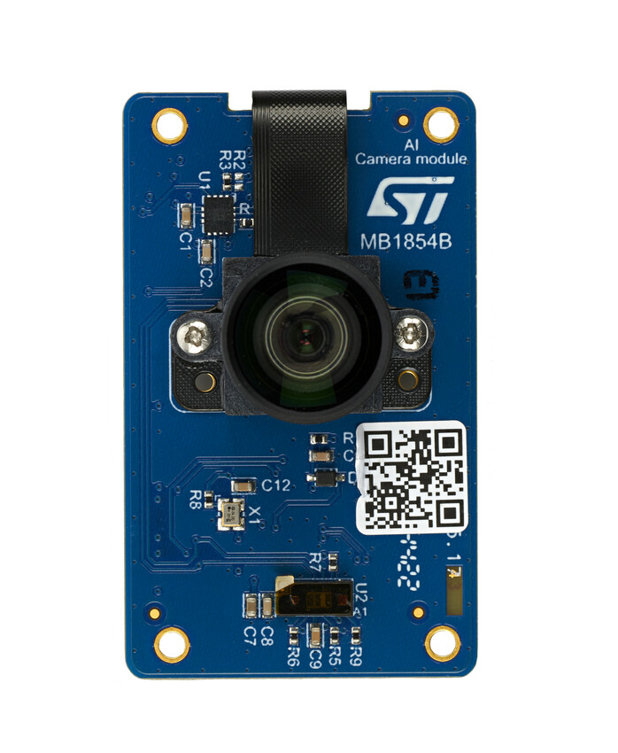
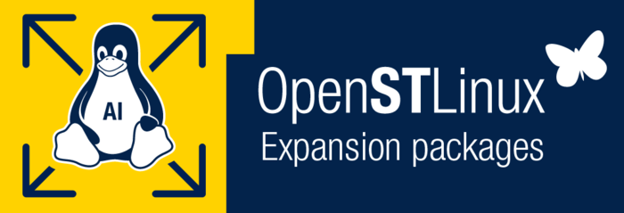

# __Image classification getting started - STM32MP2x__

The purpose of this package is to enable image classification application on a STM32MPU board.

### __Directory contents__

This repository is structured as follows:

| Directory                                                              | Content                                                   |
|:---------------------------------------------------------------------- |:--------------------------------------------------------- |
| Application                                                            | Python application script + launch script                 |
| Resources                                                              | All the resources necessary for the application           |
| Optimized_models                                                       | *Place holder* for optimized model from Developer Cloud |
| STM32MP1                                                               | Specific resources for STM32MP1x family + Readme |
| STM32MP2                                                               | Specific resources for STM32MP2x family + Readme |
| LICENSE.md                                                             | Application License file                          |

## __Before you start__

### __Hardware and Software environment__

In order to run this image classification application examples you need to have the following hardware:

- [STM32MP257F-EV1](https://www.st.com/en/evaluation-tools/stm32mp257f-ev1) discovery board
- [MB1864B]  Sony IMX335 5Mpx camera module

Only this hardware is supported for now

On software side, this getting started needs [X-LINUX-AI](https://www.st.com/en/embedded-software/x-linux-ai.html) expansion package for OpenSTLinux version `v5.1.0`.

All the information needed to install X-LINUX-AI on your board is available in the following wiki page:

- X-LINUX-AI expansion package : https://wiki.st.com/stm32mpu/wiki/Category:X-LINUX-AI_expansion_package

## __Deployment__

For STM32MPU, application code example is provided as python script to facilitate and accelerate the deployment on the target.

### __Deploy application code__

You should use the deploy.py script to automatically deploy the program on the target (if the hardware is connected to the network).

The [deployment script](../../../../image_classification/deployment/README.md) of the model zoo is used to directly populate the target with all the needed files, resources and NN model. The script use
the IP address provided in the configuration yaml file. The application source code is available `Application\` directory and can be modified easily.

### __Deploy NN model__

For STM32MP2x application deployment, NN model used is a Network Binary Graph (NBG) model. The NBG model used for this application is generated automatically using ST Edge AI Developer Cloud based on a TFLite or ONNX pre-trained model available in this model zoo.

The NBG model is necessary to be able to use hardware acceleration of the  STM32MP25 board. If the generation of the NBG model is not possible the original model (TFLite or ONNX) will be used for deployment and will run on CPU.

To generate NBG locally it is also possible to use ST Edge AI core tool with STM32MP25 target. To have more details on this mechanism please refer to the dedicated wiki article: https://wiki.st.com/stm32mpu/wiki/ST_Edge_AI:_Guide_for_MPU

## __Getting started deep dive__

The purpose of this package is to enable image classification application on a STM32MPU board.

### __Processing workflow__

The software executes an image classification on each image captured by the camera. The framerate depends on each step of the processing workflow.

Captured_image: image from the camera

Network_Preprocess - 3 steps:
   -  ImageResize: rescale the image to fit the resolution needed by the network
   -  PixelFormatConversion: convert image format (usually RGB565) to fit the network color channels (RGB888 or Grayscale)
   -  PixelValueConversion: convert to pixel type used by the network (uint8 or int8)

HxWxC: Height, Width and Number of color channels, format defined by the neural network

Network_Inference: call NBG network

Network_Postprocess: Apply post-processing operations on NN model raw outputs to be able to display inference results on the display

### __Application workflow__

The image classification application can be divided into four main parts :

- Data acquisition and preprocessing which is built with Gstreamer library
- Neural Network inference based on OpenVX library
- Neural Network post processing which is handled by common numerical computing tools like Numpy
- Graphical user interface : built with GTK3+ and Cairo libraries

### __Image processing__

The frame captured by the camera is in a standard video format. As the neural network needs to receive a square-shaped image as input, for now only one solutions is provided to reshape the captured frame before running the inference
- ASPECT_RATIO_FIT: the frame is compacted to fit into a square with a side equal to the height of the captured frame. The aspect ratio is modified.

By default the interpolation type used for resizing the input image is simple bilinear interpolation

## __Limitations__

- Supports only X-LINUX-AI latest version v5.1.0.